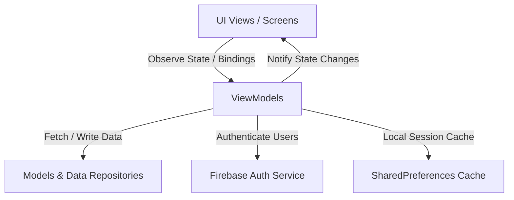

# Intelligent Solar Management System ☀️🔋

A comprehensive, cross-platform mobile application built using **Flutter** to help users estimate, plan, and optimize their solar energy system configurations. Whether setting up an AC or DC system, with or without battery backup, this app delivers calculated recommendations for solar panels, battery capacity, inverter sizing, and charge controllers.

---

## 🚀 Key Features

* **Dual System Support:** Size both AC-based and DC-based solar system loads.
* **Backup & Non-Backup Architectures:** Choose between day-use systems (no battery conversion losses) and hybrid storage setups for night/cloudy use.
* **Appliance Sizing Utility:** Select appliances from a pre-configured profile list (Ceiling/Pedestal fans, AC units, refrigerators, lights, water pumps, heaters, etc.) with default power ratings.
* **Intelligent Recommendation Engine:** Computes optimal hardware configurations (inverter wattage, battery AH capacity, solar panel array output, charge controller amperage, and system voltage).
* **Vendor Directory:** Connects users directly with certified solar equipment suppliers across major regions.
* **Secure User Management:** Integrated Firebase Authentication for user registration and session synchronization.

---

## 🛠️ Architecture & Tech Stack

The project is designed following the **Model-View-ViewModel (MVVM)** pattern to ensure loose coupling, ease of testing, and maintainability.



* **Frontend Framework:** [Flutter](https://flutter.dev) (Dart SDK `>=3.3.4 <4.0.0`)
* **State Management:** [Provider Package](https://pub.dev/packages/provider)
* **Backend Authentication:** [Firebase Core](https://pub.dev/packages/firebase_core) & [Firebase Auth](https://pub.dev/packages/firebase_auth)
* **Local Caching:** [Shared Preferences](https://pub.dev/packages/shared_preferences)
* **Visual Theme:** Material 3 with customized green accents.

---

## 📐 Solar Calculation & Sizing Formulas

The system performs calculations on the input loads using a safety headroom margin (**Calibration Factor = 1.3**) and an assumed efficiency rate (**Inverter Efficiency = 80%**).

### 1. System Voltage ($S.VOLTAGE$)
Determined dynamically for AC loads to optimize battery group setups, and hardcoded to a nominal 12V for DC loads.
* **AC Systems:**
  $$sv = \begin{cases} 
      96\text{ V} & \text{if Load} > 5000\text{ W} \\
      48\text{ V} & \text{if } 5000\text{ W} \ge \text{Load} \ge 3000\text{ W} \\
      24\text{ V} & \text{if } 3000\text{ W} \ge \text{Load} \ge 900\text{ W} \\
      12\text{ V} & \text{if Load} < 900\text{ W} 
   \end{cases}$$
* **DC Systems:**
  $$sv = 12\text{ V}$$

### 2. Inverter Sizing (AC only)
Sized to handle startup surge and continuous load requirements:
$$\text{Inverter W} = \text{round}\left( \frac{\text{Current Load} \times 1.3}{0.8} \right)$$

### 3. Battery Capacity (Ah)
Determined using a maximum $80\%$ depth of discharge limit:
$$\text{Battery Ah} = \text{round}\left( \frac{\text{Total Load (Wh)} \times 1.3}{0.8 \times sv \times 0.8} \right)$$

### 4. Solar Array Sizing (Watts)
* **Without Backup (Day-Use Only):**
  $$\text{Solar Panels W} = \text{round}(\text{Current Load} \times 1.3)$$
* **With Backup (Battery Storage):** Based on replenishing the battery bank over an average 5.5-hour sunshine window:
  $$\text{Solar Panels W} = \text{round}\left( \frac{\text{Battery Size (Ah)} \times 0.8 \times sv \times 1.3}{5.5 \times 0.8} \right)$$

### 5. Charge Controller Sizing (Amperes)
$$\text{Charge Controller A} = \text{round}\left( \frac{\text{Solar Panels W} \times 1.3}{sv} \right)$$

---

## 📂 Codebase Directory Structure

```text
lib/
├── main.dart                  # App initialization, providers, and themes
├── firebase_options.dart      # Platform configurations for Firebase Integration
├── model/                     # Data structures (User, Vendor, Device)
├── prefrences/                # Shared preference cache managers
├── routeUtils/                # App routing maps and dynamic view parameters
├── utils/                     # Custom dialog triggers and toast wrappers
├── viewmodel/                 # State controllers (SignUpViewModel, LoginViewModel)
└── ui/                        # Visual Screen files
    ├── ui_components/         # Drawer navigation, customized ListView layouts
    └── ...                    # Individual application views (About, Calculation, Home, etc.)
```

---

## 🚦 Getting Started & Local Setup

### Prerequisites
1. Installed **Flutter SDK** (Version `>= 3.3.4`)
2. Set up Android Studio, VS Code, or Xcode with Flutter plugins.

### Installation Steps
1. Clone the repository:
   ```bash
   git clone https://github.com/yourusername/Intelligent_Solar_Management_System.git
   ```
2. Navigate to the project root directory:
   ```bash
   cd Intelligent_Solar_Management_System/solar_calculation_system/solar_calculation_system
   ```
3. Fetch application dependencies:
   ```bash
   flutter pub get
   ```
4. Run the application:
   ```bash
   flutter run
   ```

*(Note: Ensure you configure a valid `google-services.json` file inside the `android/app/` folder to enable Firebase-dependent features like login and signup).*

---

## 👥 Contributors

This application was developed by **Ali Ahmed**:
* **Ali Ahmed** 

---

